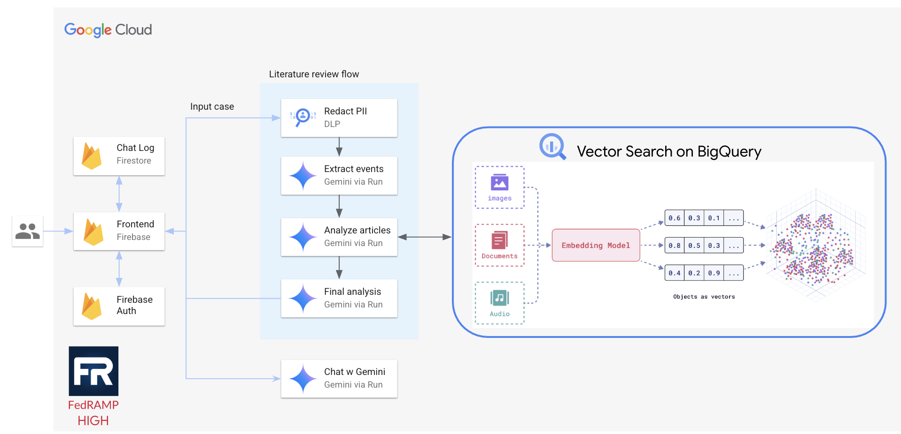

# Capricorn Medical Research Application

A medical research application that uses AI to analyze pediatric oncology cases and provide treatment recommendations by searching through PubMed articles using vector embeddings and Gemini.

## Architecture Overview



The application consists of:
- **Frontend**: React application hosted on Firebase
- **Backend**: Cloud Functions for data processing pipeline
- **Database**: Firestore for chat storage, BigQuery for article embeddings
- **AI Services**: Gemini for analysis, DLP for PII redaction

## Prerequisites

- Google Cloud Platform account with billing enabled
- Node.js 18 or higher
- Firebase CLI installed (`npm install -g firebase-tools`)
- gcloud CLI installed and configured
- SendGrid account for email notifications

## Setup Instructions

### 1. Firestore Database Setup

Create a Firestore database for storing chat conversations.

**Prerequisites:**
- Install gcloud CLI: https://cloud.google.com/sdk/docs/install
- Authenticate: `gcloud auth login`
- Set project: `gcloud config set project YOUR_GCP_PROJECT_ID`

**1. Create the database:**
```bash
# Set your configuration values
export PROJECT_ID="YOUR_GCP_PROJECT_ID"
export DATABASE_ID="YOUR_DATABASE_ID"  # e.g., "capricorn-prod", "capricorn-dev"
export DATABASE_LOCATION="YOUR_LOCATION"  # See locations below

# Create the Firestore database
gcloud firestore databases create \
  --database=$DATABASE_ID \
  --location=$DATABASE_LOCATION \
  --project=$PROJECT_ID
```

**Choose a location:**
See available locations at: https://firebase.google.com/docs/firestore/locations
- Multi-region options: `nam5` (US), `eur3` (Europe)
- Regional options: `us-central1`, `europe-west1`, etc.

**2. After creating the database, update the frontend configuration:**
```bash
cd frontend
cp .env.example .env
# Edit .env and set:
# REACT_APP_FIREBASE_DATABASE_ID=your-database-id
```

**Note**: Backend configuration will be handled in the next section using the setup script.

**3. Create Firestore security rules:**
```javascript
// Create a file named firestore.rules in your project root
rules_version = '2';
service cloud.firestore {
  match /databases/{database}/documents {
    // Allow authenticated users to read/write their own chats
    match /chats/{userId}/conversations/{document=**} {
      allow read, write: if request.auth != null && request.auth.uid == userId;
    }
  }
}
```

**4. Deploy the security rules:**
```bash
firebase deploy --only firestore:rules
```

### 2. Cloud Functions Setup

Each Cloud Function needs to be deployed with the appropriate environment variables:

#### 2.1 Create Backend Configuration

Use the provided setup script to create all `.env.yaml` files automatically:

```bash
# Run the setup script
./setup-backend-config.sh
```

The script will prompt you for:
- GCP Project ID
- Firestore Database ID
- Cloud Functions region
- BigQuery Project ID (optional, defaults to GCP Project ID)
- SendGrid API key (optional)

This creates `.env.yaml` files for all Cloud Functions:
- `backend/capricorn-chat/.env.yaml`
- `backend/capricorn-redact-sensitive-info/.env.yaml`
- `backend/capricorn-process-lab/.env.yaml`
- `backend/capricorn-retrieve-full-articles/.env.yaml`
- `backend/capricorn-final-analysis/.env.yaml`
- `backend/capricorn-feedback/.env.yaml`

**Note**: The `.env.yaml` files are already in `.gitignore` to prevent committing sensitive data.

#### 2.2 Deploy Cloud Functions

Deploy each function with its configuration:

```bash
# Deploy all functions
cd backend

# Redact Sensitive Info
cd capricorn-redact-sensitive-info
gcloud functions deploy redact-sensitive-info \
  --gen2 \
  --runtime=python311 \
  --region=YOUR_REGION \
  --source=. \
  --entry-point=redact_sensitive_info \
  --trigger-http \
  --allow-unauthenticated \
  --env-vars-file=.env.yaml

# Process Lab
cd ../capricorn-process-lab
gcloud functions deploy process-lab \
  --gen2 \
  --runtime=python311 \
  --region=YOUR_REGION \
  --source=. \
  --entry-point=process_lab \
  --trigger-http \
  --allow-unauthenticated \
  --env-vars-file=.env.yaml

# Retrieve Full Articles
cd ../capricorn-retrieve-full-articles
gcloud functions deploy retrieve-full-articles \
  --gen2 \
  --runtime=python311 \
  --region=YOUR_REGION \
  --source=. \
  --entry-point=retrieve_full_articles \
  --trigger-http \
  --allow-unauthenticated \
  --memory=1GB \
  --timeout=540s \
  --env-vars-file=.env.yaml

# Final Analysis
cd ../capricorn-final-analysis
gcloud functions deploy final-analysis \
  --gen2 \
  --runtime=python311 \
  --region=YOUR_REGION \
  --source=. \
  --entry-point=final_analysis \
  --trigger-http \
  --allow-unauthenticated \
  --memory=1GB \
  --env-vars-file=.env.yaml

# Chat
cd ../capricorn-chat
gcloud functions deploy chat \
  --gen2 \
  --runtime=python311 \
  --region=YOUR_REGION \
  --source=. \
  --entry-point=chat \
  --trigger-http \
  --allow-unauthenticated \
  --env-vars-file=.env.yaml

# Feedback
cd ../capricorn-feedback
gcloud functions deploy send-feedback-email \
  --gen2 \
  --runtime=python311 \
  --region=YOUR_REGION \
  --source=. \
  --entry-point=send_feedback_email \
  --trigger-http \
  --allow-unauthenticated \
  --env-vars-file=.env.yaml
```

### 3. BigQuery Setup

The application requires BigQuery datasets with PubMed article embeddings and metadata.

#### 3.1 Service Account Setup

1. Create a service account:
   ```bash
   gcloud iam service-accounts create capricorn-bigquery-reader \
     --display-name="Capricorn BigQuery Reader" \
     --project=$PROJECT_ID
   ```

2. Grant BigQuery permissions:
   ```bash
   gcloud projects add-iam-policy-binding $BIGQUERY_PROJECT_ID \
     --member="serviceAccount:capricorn-bigquery-reader@$PROJECT_ID.iam.gserviceaccount.com" \
     --role="roles/bigquery.dataViewer"
   ```

3. Create and download service account key:
   ```bash
   gcloud iam service-accounts keys create bigquery-service-account.json \
     --iam-account=capricorn-bigquery-reader@$PROJECT_ID.iam.gserviceaccount.com
   ```

#### 3.2 BigQuery Dataset Transfer

**Important**: To set up the BigQuery dataset with PubMed embeddings, you need assistance from the Google team:

1. Contact the GPS-RIT team at: **gps-rit@google.com**
2. Follow the setup guide: https://docs.google.com/document/d/1__5TOLrIEoUbiksQdNVKUR5hQW5E0o9nOM-WBiHyzjo/edit?tab=t.0

The following datasets and tables are required:
```
YOUR_BIGQUERY_PROJECT.pmid_uscentral.pmid_embed_nonzero
YOUR_BIGQUERY_PROJECT.pmid_uscentral.pmid_metadata
YOUR_BIGQUERY_PROJECT.journal_rank.scimagojr_2023
```

### 4. Frontend Configuration

1. Create environment configuration:
   ```bash
   cd frontend
   
   # Create .env file (already in .gitignore)
   cat > .env << EOF
   REACT_APP_FIREBASE_API_KEY=YOUR_FIREBASE_API_KEY
   REACT_APP_FIREBASE_AUTH_DOMAIN=YOUR_PROJECT_ID.firebaseapp.com
   REACT_APP_FIREBASE_PROJECT_ID=YOUR_PROJECT_ID
   REACT_APP_FIREBASE_STORAGE_BUCKET=YOUR_PROJECT_ID.appspot.com
   REACT_APP_FIREBASE_MESSAGING_SENDER_ID=YOUR_MESSAGING_SENDER_ID
   REACT_APP_FIREBASE_APP_ID=YOUR_APP_ID
   REACT_APP_FIREBASE_DATABASE_ID=YOUR_DATABASE_ID
   EOF
   ```

2. Update API endpoints in `src/utils/api.js`:
   ```javascript
   // Replace with your Cloud Function URLs
   const API_ENDPOINTS = {
     redactPII: 'https://YOUR_REGION-YOUR_PROJECT_ID.cloudfunctions.net/redact-sensitive-info',
     processLab: 'https://YOUR_REGION-YOUR_PROJECT_ID.cloudfunctions.net/process-lab',
     retrieveArticles: 'https://YOUR_REGION-YOUR_PROJECT_ID.cloudfunctions.net/retrieve-full-articles',
     finalAnalysis: 'https://YOUR_REGION-YOUR_PROJECT_ID.cloudfunctions.net/final-analysis',
     chat: 'https://YOUR_REGION-YOUR_PROJECT_ID.cloudfunctions.net/chat',
     feedback: 'https://YOUR_REGION-YOUR_PROJECT_ID.cloudfunctions.net/send-feedback-email'
   };
   ```

3. Update Firebase configuration to use the database ID:
   ```javascript
   // In src/firebase.js
   export const db = getFirestore(app, process.env.REACT_APP_FIREBASE_DATABASE_ID);
   ```

### 5. Deploy Frontend

1. Build the application:
   ```bash
   cd frontend
   npm install
   npm run build
   ```

2. Deploy to Firebase Hosting:
   ```bash
   firebase init hosting  # Select your project and 'build' as public directory
   firebase deploy --only hosting
   ```

### 6. Enable Required APIs

Enable the following APIs in your GCP project:
```bash
gcloud services enable \
  firestore.googleapis.com \
  cloudfunctions.googleapis.com \
  cloudbuild.googleapis.com \
  dlp.googleapis.com \
  aiplatform.googleapis.com \
  bigquery.googleapis.com \
  --project=$PROJECT_ID
```

## Support

For BigQuery dataset setup assistance, contact: **gps-rit@google.com**

For application issues, please submit feedback through the application's feedback feature.
